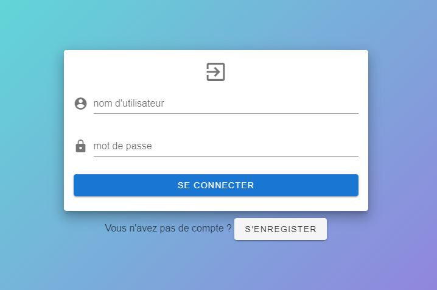
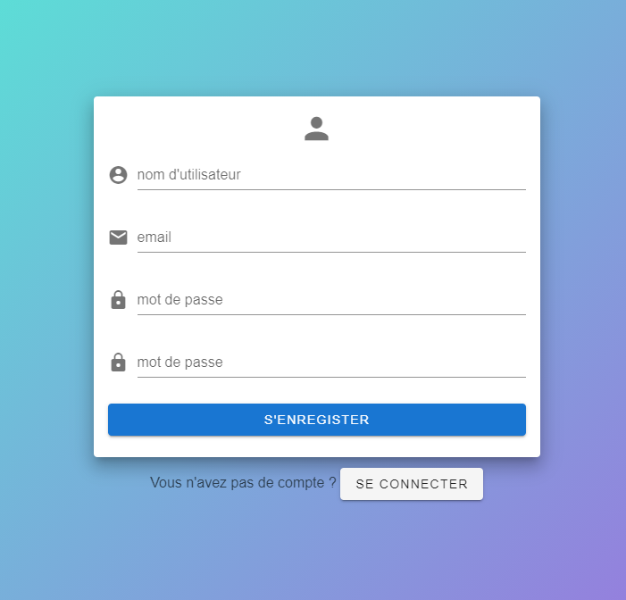
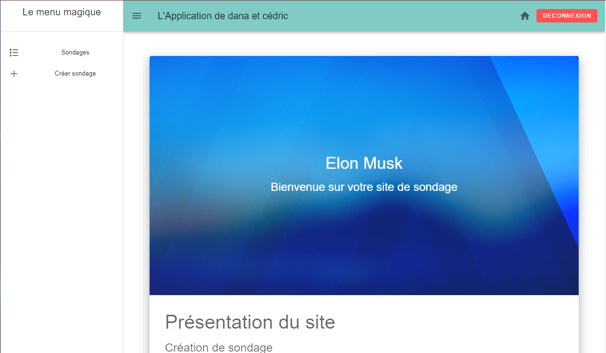
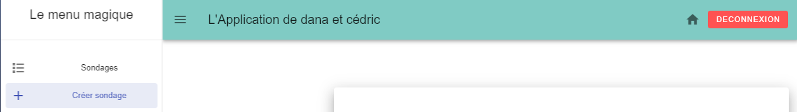
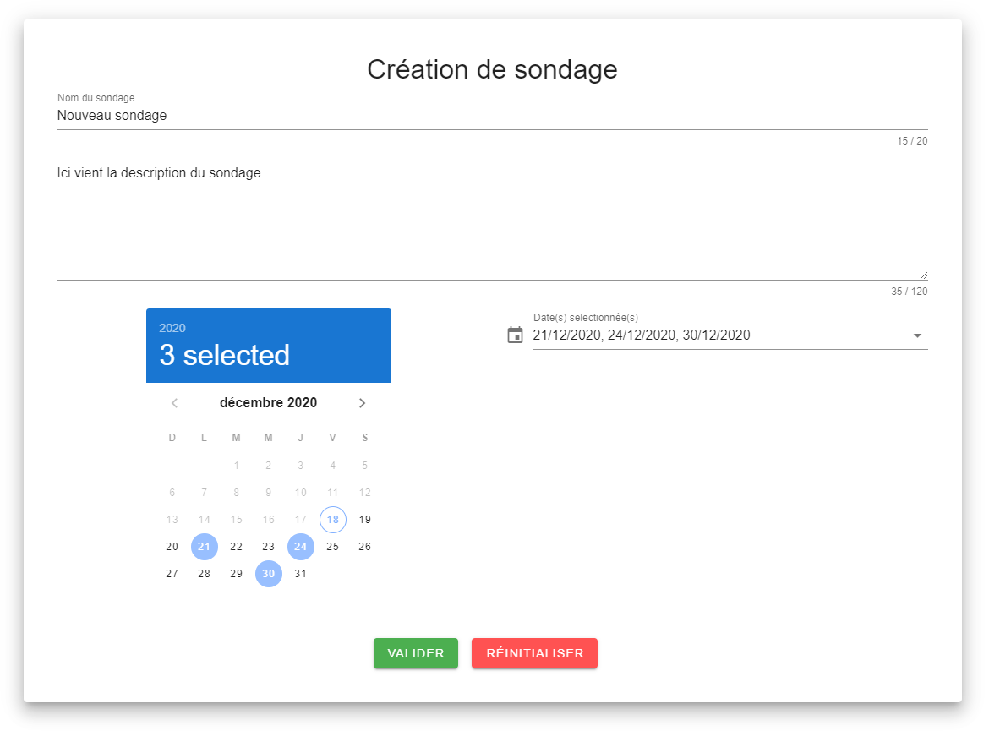

# ESIEA Web Programming Mobile Oriented

## Project configuration
For the front of the website we choose a framework named Vue.js to make it single page.
We merge it to a framework named vuetify to make the website more easily with prefab tools.
For the EDI we used WebStorm WebStorm 2020.2.4 in order to easily integrate Node.js and the npm package manager.
For the back we have used Spring boot JWT, this part is detailled in this git repository : https://github.com/Dedridec/Projet_PWOM_Back

If you don't have Node.js you need to install it.

To try it, you must also install those differents framework with npm :
- npm install vue-router
- npm install vuetify
- npm install vue-router
- npm install vuex
- npm install vee-validate@2.2.15
- npm install axios
- npm install bootstrap jquery popper.js
- npm install @fortawesome/fontawesome-svg-core @fortawesome/free-solid-svg-icons @fortawesome/vue-fontawesome

## Fonctionnalities

### Login and Logup

The website has a vue for the login/logup.
The form is checked before sending it, if the form is incorrect, the user is notify.
When the form is correctly fill, a POST request is send to the server, the user can see the answer according to an error or a success.

To connect, the user enter his username and his password, if the form is incorrect, he is notify.
When the form correctly field, a POST request is send to the server. If it is ok, then he receive a token and store it in memory.
A Token control access is used in our website, if someone try to access the website without token, he is redirect to the login page and vice versa, if he try to log again without disconnect, he is redirect to the website.

### The website

#### Home page
When you are connected, you can see the home page, this page is a vue that can be change with the "Hamburger" menu at the top left.

#### Navigation Bar
The website has a navigation bar that contain the button for the "Hamburger" menu, the website name, the home button to go back to the home page and a Log out.

#### "Hamburger" menu
This menu is used to navigate from the home page to the other vue, "Sondages" and "Créer un Sondage".

#### Sondage
In this vue we can see all surveys.
They are organized in a list <v-expesion-panels> with them title, it means that if you click on one, it expand to show the details.
This list is filled by a GET request that collect all surveys.
Then you can read the description and the available dates.
You can answer them by choosing the date(s) when you are available and click on send ("Envoyer").
When you send it, a POST request is send to the server, the user is notify of the answer of the server, the survey panel then retract and become unclickable so it is impossible to answer twice.
The check of already answer is made with a GET resquest that collect all answers of the user.

#### Créer un sondage
In this vue, it is possible to create a survey that will appear in the list of surveys.

In this form, you have to enter a name for the survey, a description and the date(s) of availibility.
Your obligated to enter max 20 letters for the name and 120 letters for the description.
You can't either choose a date between today.
The form is checked for is conformity.
When all is ready, you can click on validate ("Valider") to send or reset ("Réinitialiser") to clear the form.
If you validate, a POST request is send to the server, the user is informed if the request succeded.

